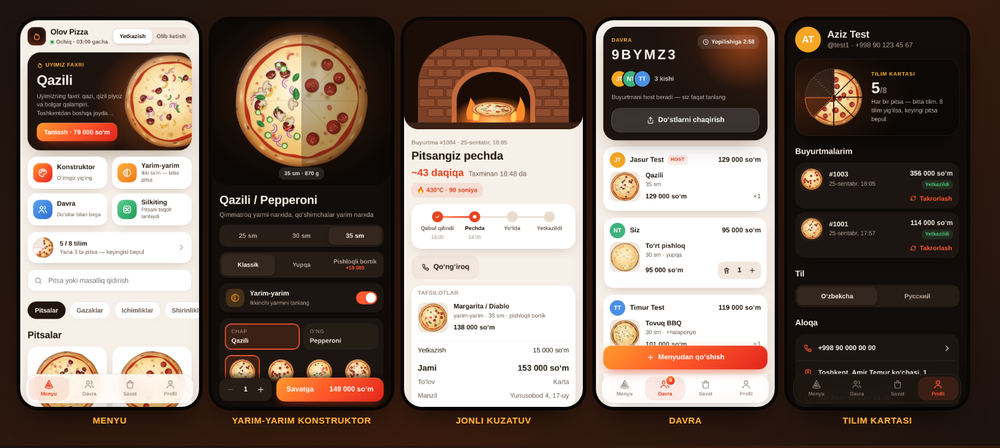

# 🔥 Olov Pizza — Telegram bot + Mini App

Pitsaxona uchun Telegram Mini App: jonli konstruktor, yarim-yarim pitsa, "Davra" (do'stlar
bilan bitta buyurtma), buyurtmani pechdan eshigingizgacha jonli kuzatish, tilim kartasi.



## Texnologiyalar

| Qatlam             | Texnologiya                                                              |
| ------------------ | ------------------------------------------------------------------------ |
| Til                | **TypeScript** (backend, frontend, umumiy kod, testlar) — `strict` rejim |
| Backend            | Node.js 22+, **Express 5**, **Telegraf** (bot)                           |
| Ma'lumotlar bazasi | **SQLite** + **Prisma ORM** (migratsiyalar bilan)                        |
| Validatsiya        | **Zod** — har bir so'rov, `.env` va Telegram `initData`                  |
| Frontend           | **React 18 + Vite**, Telegram WebApp API                                 |
| Sifat              | ESLint (typescript-eslint), Prettier, `node:test`, GitHub Actions        |

## Arxitektura

```
            Telegram (Mini App)                      Telegram (bot)
                   │ x-telegram-init-data                  │ webhook / polling
                   ▼                                        ▼
  ┌──────────────── Routes ────────────────┐        ┌──── bot/ ─────────────┐
  │ telegramAuth → validate(Zod) → limit   │        │ handlers (mijoz,      │
  └────────────────────┬───────────────────┘        │ oshxona, to'lov)      │
                       ▼                            └──────────┬────────────┘
                  Controllers  (HTTP ↔ DTO, hech qanday biznes mantiq yo'q)
                       ▼                                       ▼
                   Services  (biznes qoidalar: narx, holatlar, Davra, tilimlar)
                       │                        │
                       ▼                        ▼  EventBus: order:*, group:*, user:*
                 Prisma ORM → SQLite        ┌───┴──────────────┐
                                            ▼                  ▼
                                      SSE (Mini App)     Notifier (bot xabarlari)
```

- **Routes** faqat yo'l, middleware va controller'ni bog'laydi.
- **Controllers** so'rovdan tekshirilgan ma'lumotni oladi (`read(req, schema)`), servisni chaqiradi, DTO qaytaradi.
- **Services** — butun biznes mantiq. Ular HTTP ham, Telegram ham bilmaydi; faqat hodisa chiqaradi.
- **Bot** va **SSE** hodisalarga obuna bo'ladi — qatlamlar bir-biriga bog'lanmaydi.
- **shared/** — server va Mini App uchun yagona manba: turlar (DTO), menyu, narx hisoblash, Zod sxemalari.
  Mini App ko'rsatgan narx va server hisoblagan narx doim bir xil.

## Papka tuzilmasi

```
pizza-app/
├── prisma/
│   ├── schema.prisma               # User, Order, Group, GroupMember, GroupItem, StopItem
│   └── migrations/                 # SQL migratsiyalar (buyurtma raqami #1001 dan)
├── shared/                         # Server + Mini App umumiy kodi
│   ├── types.ts                    # DTO turlari (API javoblari)
│   ├── schemas.ts                  # Zod sxemalari (buyurtma, savat, davra, parametrlar)
│   ├── menu.ts                     # Menyu: pitsalar, masalliqlar, ichimliklar
│   ├── pricing.ts                  # Narx, savat, hisobni bo'lish
│   ├── shop.ts                     # Pitsaxona sozlamalari, ish vaqti, masofa
│   ├── status.ts                   # Buyurtma holatlari va o'tishlar
│   └── format.ts                   # Pul, vaqt, telefon formati
├── server/
│   ├── index.ts                    # Ishga tushirish nuqtasi
│   ├── app.ts                      # Composition root: baza → servislar → bot → HTTP
│   ├── config/env.ts               # .env ni Zod bilan tekshirish
│   ├── routes/                     # index.ts, order.routes.ts, group.routes.ts
│   ├── controllers/                # user, order, group, system
│   ├── services/                   # user, order, group, stoplist + mappers (Prisma ↔ DTO)
│   ├── middlewares/                # telegram-auth, validate, rate-limit, error-handler
│   ├── utils/telegram-init-data.ts # initData HMAC-SHA256 tekshiruvi
│   ├── lib/                        # prisma, events (EventBus), sse, errors, logger, clock
│   ├── bot/                        # gateway, handlers/, notifier, keyboards, texts
│   └── types/express.d.ts          # Request kengaytmasi (user, validated)
├── client/                         # Mini App (React + Vite)
│   ├── index.html
│   └── src/
│       ├── screens/                # Home, Builder, Cart, Checkout, Tracker, Group, Profile
│       ├── components/             # kartochkalar, pech/kuryer sahnalari, UI
│       ├── pizza/                  # SVG pitsa renderer
│       ├── lib/                    # store, api, telegram, sensors, i18n, nav
│       └── types/                  # Telegram WebApp turlari
├── test/                           # 51 ta test: narx, Zod, initData, API, Davra, SSE, bot
├── scripts/dev.ts                  # npm run dev
├── eslint.config.js, .prettierrc.json
├── tsconfig.base.json              # umumiy strict sozlamalar
├── tsconfig.json                   # server + shared → build/
├── client/tsconfig.json            # Mini App
└── vite.config.ts
```

## npm paketlari

**dependencies** (serverda ishlaydi):

| Paket            | Vazifasi                                                  |
| ---------------- | --------------------------------------------------------- |
| `express`        | HTTP server, API yo'llari                                 |
| `telegraf`       | Telegram bot                                              |
| `@prisma/client` | Prisma ORM mijozi                                         |
| `prisma`         | Prisma CLI (`migrate deploy` ishga tushishda chaqiriladi) |
| `zod`            | Validatsiya                                               |

**devDependencies** (ishlab chiqish va build):

| Paket                                                                               | Vazifasi                                                                           |
| ----------------------------------------------------------------------------------- | ---------------------------------------------------------------------------------- |
| `typescript`, `tsx`                                                                 | TypeScript kompilyatori va TS'ni to'g'ridan-to'g'ri ishga tushirish (dev, testlar) |
| `@types/node`, `@types/express`, `@types/react`, `@types/react-dom`                 | Turlar                                                                             |
| `react`, `react-dom`, `vite`, `@vitejs/plugin-react`                                | Mini App                                                                           |
| `eslint`, `@eslint/js`, `typescript-eslint`, `eslint-plugin-react-hooks`, `globals` | Lint                                                                               |
| `prettier`                                                                          | Formatlash                                                                         |
| `@ngrok/ngrok`                                                                      | Lokal ishda https tunnel (ixtiyoriy)                                               |

## Ishga tushirish (bosqichma-bosqich)

Talab: **Node.js 22.13+**.

**1. Paketlar**

```bash
cd pizza-app
npm install            # postinstall avtomatik `prisma generate` qiladi
```

**2. Sozlamalar**

```bash
cp .env.example .env   # npm run dev buni o'zi ham qiladi
```

`.env` da kamida `BOT_TOKEN` va `ADMIN_CHAT_ID` ni yozing (botsiz ham brauzerda sinash mumkin).
Server ishga tushganda `.env` Zod bilan tekshiriladi — xato bo'lsa aniq qaysi qator noto'g'riligini aytadi.

**3. Baza**

```bash
npm run db:deploy      # prisma/migrations dagi jadvallarni yaratadi (npm run dev buni o'zi qiladi)
```

**4. Lokal ishga tushirish**

```bash
npm run dev
```

Bu buyruq migratsiyalarni qo'llaydi, `.env` da `NGROK_AUTHTOKEN` bo'lsa https tunnel ochadi,
API serverni (`tsx watch`, 3000) va Mini App'ni (Vite, 5173) birga ishga tushiradi. Bot menyu
tugmasi joriy manzilga o'zi bog'lanadi.

- Brauzerda (botsiz): <http://localhost:5173/?dev=1>. Davrani sinash uchun ikkinchi oynada `?dev=2`.
- Kuzatuvni botsiz sinash (`ALLOW_DEV_USER=true` bo'lganda):
  `curl -X POST localhost:3000/api/dev/orders/1001/advance -H 'x-dev-user: 1'`

**5. Tekshirish**

```bash
npm run check          # typecheck + lint + 51 ta test + build
```

**6. Production**

```bash
npm run build          # prisma generate + tsc (build/) + vite (dist/client)
NODE_ENV=production PUBLIC_URL=https://domen.uz npm start   # migrate deploy + node build/server/index.js
```

## Xavfsizlik

- **initData tekshiruvi** (`server/utils/telegram-init-data.ts`): har bir API so'rovida Telegram imzosi
  bot tokeni bilan tekshiriladi — `secret = HMAC_SHA256("WebAppData", BOT_TOKEN)`,
  `hash = HMAC_SHA256(secret, data_check_string)`. Taqqoslash `timingSafeEqual` bilan, 24 soatdan
  eski imzo rad etiladi, `user` maydoni Zod bilan tekshiriladi. Imzosiz so'rov → `401`.
- **Zod**: har bir so'rov tanasi va parametri route darajasida tekshiriladi; noma'lum pitsa, masalliq,
  noto'g'ri telefon yoki manzil controller'gacha yetib bormaydi. Izohlardagi boshqaruv belgilari tozalanadi.
- **Narxga ishonilmaydi**: mijoz yuborgan narx e'tiborsiz qoldiriladi, server `shared/pricing.ts` bilan qayta hisoblaydi.
- **Ruxsatlar**: buyurtmani faqat egasi (va davradoshlari) ko'radi; davradoshlarga hostning telefoni ko'rsatilmaydi;
  oshxona tugmalarini faqat `ADMIN_IDS` yoki admin guruh a'zolari bosa oladi.
- **Poyga holatlari**: tilimlar shartli `updateMany` bilan yechiladi, davradan faqat bitta buyurtma o'tadi.
- **To'lov**: `pre_checkout_query` da buyurtma holati va summasi qayta tekshiriladi.
- **Webhook** maxfiy token bilan himoyalangan; rate limit buyurtma va davra yo'llarida.
- `ALLOW_DEV_USER` productionda doim o'chiq (hatto `.env` da yoqilgan bo'lsa ham).

## Botni sozlash

1. [@BotFather](https://t.me/BotFather) → `/newbot` → token `BOT_TOKEN` ga
2. Oshxona guruhini oching, botni qo'shing, guruh ID sini `ADMIN_CHAT_ID` ga yozing
3. _(Ixtiyoriy)_ `ADMIN_IDS` — holatni o'zgartira oladigan xodimlar
4. _(Ixtiyoriy)_ BotFather → Payments → Click/Payme → `PAYMENT_PROVIDER_TOKEN`
5. _(Ixtiyoriy)_ BotFather → `/newapp` → `MINIAPP_SHORT_NAME` (Davra havolasi ilovani to'g'ridan-to'g'ri ochadi)

Oshxona tugmalari: `✅ Qabul qilish` → `🔥 Pechga` → `🛵 Kuryerga berildi` / `📦 Tayyor` → `🏁 Yetkazildi`.
Buyruqlar: `/stats` (bugungi tushum), `/stop` (tugagan mahsulotlar), mijozlar uchun `/start`, `/orders`, `/help`.

## Prisma buyruqlari

| Buyruq                               | Vazifasi                                                     |
| ------------------------------------ | ------------------------------------------------------------ |
| `npm run db:migrate -- --name <nom>` | `schema.prisma` o'zgargandan keyin yangi migratsiya          |
| `npm run db:deploy`                  | Migratsiyalarni qo'llash (server `npm start` da o'zi qiladi) |
| `npm run db:studio`                  | Bazani brauzerda ko'rish                                     |

## Menyu va sozlamalar

| Nima                                                     | Qayerda                                                       |
| -------------------------------------------------------- | ------------------------------------------------------------- |
| Nom, telefon, manzil, ish vaqti, yetkazish narxi, radius | `shared/shop.ts`                                              |
| Pitsalar, narxlar, masalliqlar, ichimliklar              | `shared/menu.ts`                                              |
| Matnlar                                                  | `client/src/lib/i18n.ts` (ilova), `server/bot/texts.ts` (bot) |

Yangi pitsa uchun rasm kerak emas — Mini App uni masalliqlaridan o'zi chizadi.

## Serverga joylash (Render)

1. **New → Web Service** → repozitoriya, **Root Directory:** `pizza-app`
2. **Build:** `npm ci --include=dev && npm run build` · **Start:** `npm start`
3. Environment: `NODE_VERSION=22`, `NODE_ENV=production`, `BOT_TOKEN`, `ADMIN_CHAT_ID`

`PUBLIC_URL` shart emas (Render `RENDER_EXTERNAL_URL` beradi). `render.yaml` tayyor.

> ⚠️ Bepul tarifda disk vaqtinchalik — baza har deploy'da tozalanadi. Doimiy saqlash uchun Render
> **Disk** ulang va `DATABASE_URL=file:/var/data/pizza.db` qiling, yoki VPS ishlating.

## API

Barcha so'rovlar `x-telegram-init-data` header bilan. Javob: `{ ok: true, ... }` yoki
`{ ok: false, error: "<kod>", issues?: [...] }`.

| Metod      | Yo'l                                                | Zod sxemasi                                 |
| ---------- | --------------------------------------------------- | ------------------------------------------- |
| GET        | `/api/health`                                       | — (ochiq)                                   |
| GET        | `/api/bootstrap`                                    | —                                           |
| PATCH      | `/api/me`                                           | `updateMeSchema`                            |
| GET        | `/api/orders` · `/api/orders/:id`                   | `idParamSchema`                             |
| POST       | `/api/orders`                                       | `createOrderSchema`                         |
| POST       | `/api/orders/:id/cancel` · `/invoice` · `/cash`     | `idParamSchema`                             |
| POST       | `/api/groups`                                       | —                                           |
| GET · POST | `/api/groups/:code` · `/join` · `/leave` · `/share` | `codeParamSchema`                           |
| POST       | `/api/groups/:code/items`                           | `addGroupItemSchema`                        |
| PATCH      | `/api/groups/:code/items/:id`                       | `itemParamSchema` + `updateGroupItemSchema` |
| GET        | `/api/stream`                                       | — (SSE)                                     |
